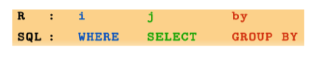

A refresher on data tables.

## Subsetting

```{r}
# data-tables
library(data.table)
dt <- data.table(mtcars)
dt[,mean(mpg)]

# Subsetting - average mpg by am
dt[, mean(mpg), by=am]
dt[, mean(mpg), by=.(am,cyl)]

# Adding a label for the computed average
dt[, .(avg = mean(mpg)), by=.(am,cyl)]
```
Above - data table subsetting 

The basic model for all data tables is 
DT[i,j,by]




## Tabulation

N is a special variable telling us how many rows
```{r}
dt[, .N]
```


If we group by a variable, N will tell us the count of rows per group
```{r}
dt[, .N, by=cyl]
```

Let's use this to count the number of rows where wt > 1.5, grouped by am (transmission type)

```{r}
dt[wt>1.5, .N, by=am]
```

## Sorting

We can do this easily and fast. Below - the top 5 vehicles in descending order of mpg
```{r}
head(dt[order(-mpg)], 5)
```

We can also sort on multiple keys, and can use a second bracket notation to subset the data, since DT inherits from data.frame.
The below sorts by descending mpg and ascending wt.
```{r}
dt[order(-mpg,wt)][1:5]
```
## Performance benefits - fread instead of read.csv

DT is lightning fast. Let's read in an 80mb csv file.

```{r}
system.time(df.crimes <- read.csv("raw-data/chi_crimes.csv", header=TRUE,sep=","))
system.time(dt.crimes <- fread("raw-data/chi_crimes.csv", header = TRUE, sep = ","))
```

## More summarising

Let's find out the number of unique values in each column in the DT
```{r}
sapply(dt.crimes, function(x) length(unique(x)))
```

Now let's run a xtab of the number of calls per district
```{r}
dt.crimes[, .N, by=District][order(-N)]
```

Now we subset by District and Community area
```{r}
dt.crimes[District==20 & `Community Area` ==3][order(-ID)][1:10]
```

```{r}
dt[ cyl  %in% c(4,6)][1:5]
```

### Summarising multiple variables at once
```{r}
dt[, .(avg_mpg = mean(mpg), avg_wt=mean(wt)), by=am]
```
